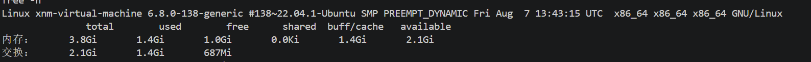
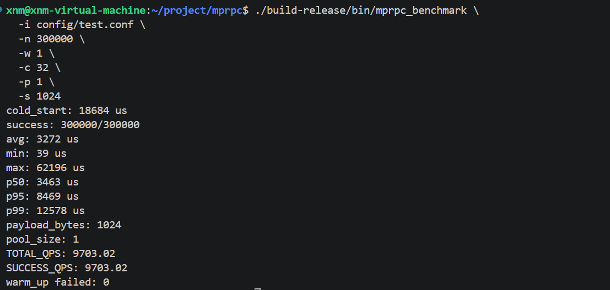
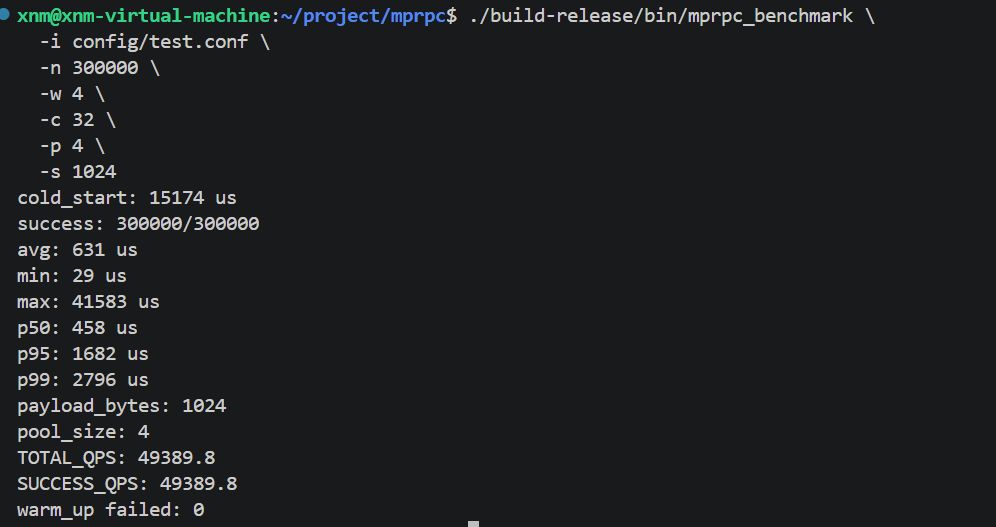
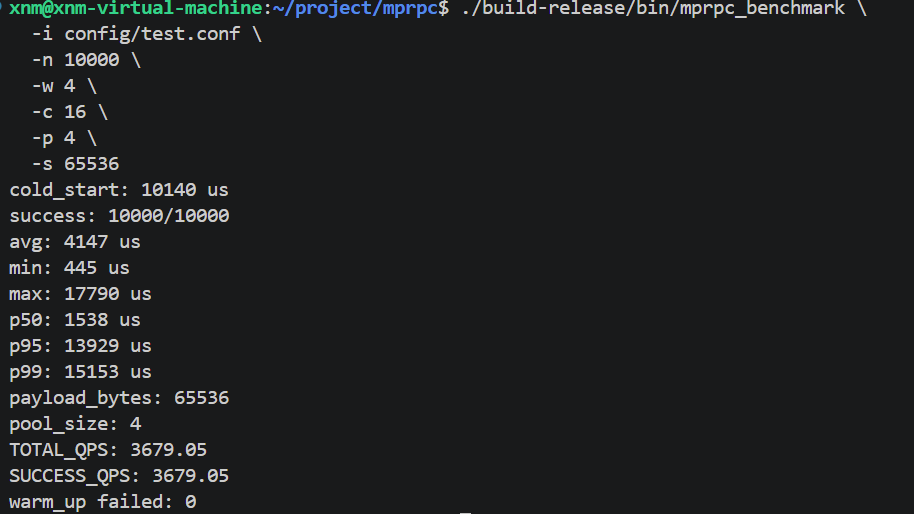
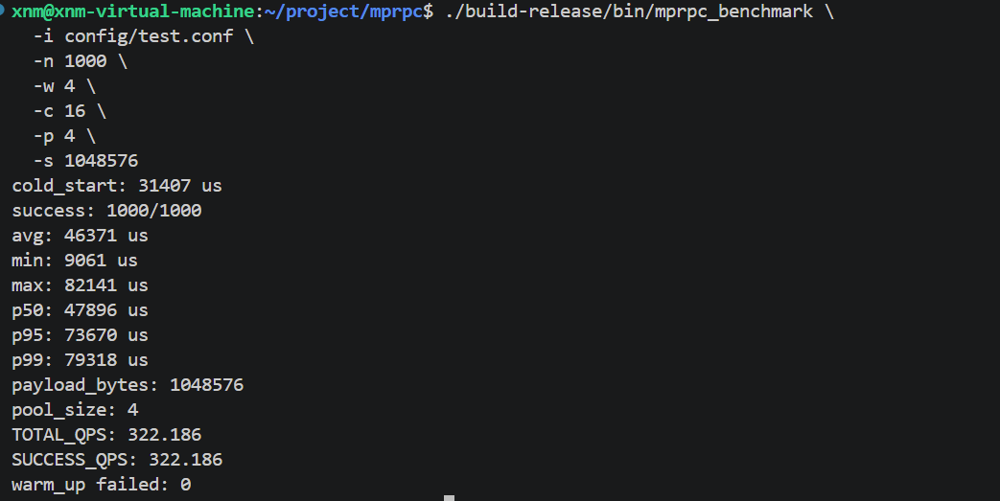
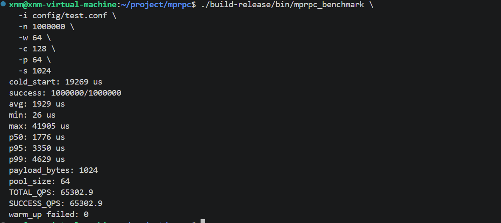
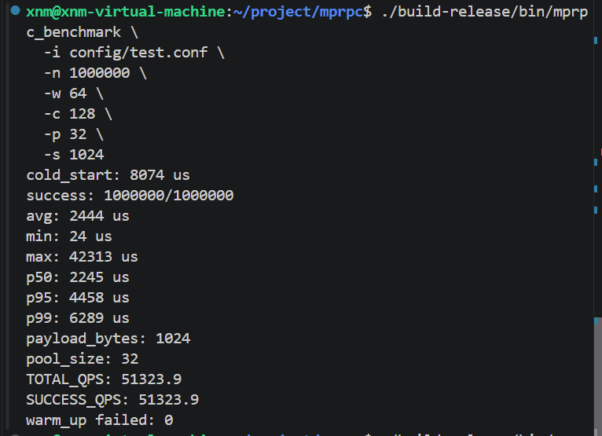

# mprpc

一个面向高并发场景的高性能 C++ RPC 框架实践项目，基于 Protocol Buffers、Muduo 和 ZooKeeper，支持服务发现、长连接复用、endpoint 级连接池和多 Provider 轮询。

在 Ubuntu 22.04 x86_64 虚拟机上，使用 1 KiB 请求、128 个并发 worker 和每个 endpoint 64 条连接的配置，benchmark 实测总吞吐达到 **65,302.9 QPS**，p99 延迟为 **4.629 ms**，成功率为 **100%**。该结果用于展示当前实现的高并发处理能力，具体测试条件和终端输出见[性能结果](#性能结果)。

**技术关键词：** C++17 · Muduo · Protocol Buffers · ZooKeeper · TCP 长连接 · 连接池 · 服务发现 · 并发 benchmark

## 项目定位

mprpc 是一个用于实践高并发网络编程的 C++ RPC 框架。项目围绕一次 RPC 调用的完整生命周期展开，从服务发现、连接选择、请求编码、网络传输到响应校验，形成了一条可运行、可观测、可压测的请求链路。

项目的重点不是单纯实现一个“能调用”的 RPC，而是解决高并发场景下连接复用和请求生命周期管理的问题：

- 以 Provider endpoint 为边界维护独立连接池；
- 以单条连接为边界维护 pending request、收包、超时和重连状态；
- 通过 benchmark 验证连接池、大消息、多 Provider 和峰值吞吐场景。

## 核心能力

- 自定义 RPC 二进制帧协议；
- Protocol Buffers 请求和响应序列化；
- ZooKeeper 服务注册与服务发现；
- Provider endpoint 轮询；
- 客户端长连接复用；
- 一个 MpRpcChannel 管理每个 endpoint 的固定大小连接池；
- 每条连接独立维护 pending request、收包线程、超时线程和重连状态；
- 请求超时、连接断开、乱序响应和大消息传输处理；
- 可调节并发数、连接池大小和 payload 大小的 benchmark。

关键实现位置：

| 模块 | 代码位置 |
|---|---|
| Channel、服务发现和 endpoint 级连接池 | [`src/mprpc_channel.cc`](src/mprpc_channel.cc) |
| 客户端连接、pending 生命周期和超时处理 | [`src/mprpc_client_connection.cc`](src/mprpc_client_connection.cc) |
| RPC 帧编码与解码 | [`src/mprpc_codec.cc`](src/mprpc_codec.cc) |
| Provider 服务注册和请求处理 | [`src/mprpc_provider.cc`](src/mprpc_provider.cc) |
| 并发与性能 benchmark | [`benchmark/rpc_benchmark.cc`](benchmark/rpc_benchmark.cc) |

## 项目结构

```text
.
├── benchmark/           # 性能测试程序
├── config/              # Provider 和客户端配置
├── example/             # 用户服务示例、Provider 和 Consumer
├── src/                 # RPC 框架实现和公共头文件
├── docs/benchmark/      # 性能测试环境和终端截图
├── autobuild            # Linux 一键构建脚本
├── CMakeLists.txt
└── README.md
```

当前发布版本暂不包含独立测试目录；后续会在补充测试后单独更新发布内容。

## 运行环境

本项目在以下环境完成开发和测试：

| 项目 | 信息 |
|---|---|
| OS | Ubuntu 22.04.1 |
| Kernel | 6.8.0-138-generic |
| Architecture | x86_64 |
| Memory | 3.8 GiB |
| Swap | 2.1 GiB |
| Build type | Release |

## 依赖

Ubuntu 环境需要准备：

- C++17 编译器
- CMake
- Protocol Buffers（包含 `protoc`）
- Muduo
- ZooKeeper C client
- pthread

依赖名称和安装方式取决于本机发行版和软件源。确认依赖可用后执行构建。

## 构建

项目不提交由 Protobuf 生成的 `.pb.cc` 和 `.pb.h` 文件。CMake 会在构建目录中根据
`src/mprpc_header.proto` 和 `example/user.proto` 自动生成它们。

在 Ubuntu/Linux 下可以直接执行自动构建脚本：

    chmod +x autobuild
    ./autobuild

脚本会以 Release 模式配置项目，并使用本机 CPU 并行编译，产物位于
`build-release/bin/`。

也可以手动执行：

    cmake -S . -B build-release \
      -DCMAKE_BUILD_TYPE=Release

    cmake --build build-release -j"$(nproc)"

如果只需要构建 benchmark：

    cmake --build build-release \
      --target mprpc_benchmark \
      -j"$(nproc)"

## 启动示例

先启动 ZooKeeper，并确认 127.0.0.1:2181 可用。

启动单个 Provider：

    ./build-release/bin/provider \
      -i config/test.conf

在另一个终端运行 Consumer：

    ./build-release/bin/consumer \
      -i config/test.conf

Provider 使用的配置格式：

    rpcserverip=127.0.0.1
    rpcserverport=8000
    zookeeperip=127.0.0.1
    zookeeperport=2181

## Benchmark

Benchmark 参数：

| 参数 | 含义 |
|---|---|
| -i | 配置文件路径 |
| -n | 正式请求总数 |
| -w | 预热请求数 |
| -c | worker 并发数 |
| -p | 每个 Provider endpoint 的连接池大小 |
| -s | 业务 payload 大小，单位为字节 |

Benchmark 会输出：

    cold_start
    success
    avg
    min
    max
    p50
    p95
    p99
    payload_bytes
    pool_size
    TOTAL_QPS
    SUCCESS_QPS
    warm_up failed

其中 -s 生成的请求内容会由示例 Provider 回显，benchmark 会校验响应内容，因此大消息测试覆盖请求序列化、发送、Provider 解码、响应序列化、接收和响应拷贝。

### 单连接基线

    ./build-release/bin/mprpc_benchmark \
      -i config/test.conf \
      -n 300000 \
      -w 1 \
      -c 32 \
      -p 1 \
      -s 1024

### 连接池测试

    ./build-release/bin/mprpc_benchmark \
      -i config/test.conf \
      -n 300000 \
      -w 4 \
      -c 32 \
      -p 4 \
      -s 1024

### 大消息测试

    ./build-release/bin/mprpc_benchmark \
      -i config/test.conf \
      -n 10000 \
      -w 4 \
      -c 16 \
      -p 4 \
      -s 65536

    ./build-release/bin/mprpc_benchmark \
      -i config/test.conf \
      -n 1000 \
      -w 4 \
      -c 16 \
      -p 4 \
      -s 1048576

### 峰值吞吐测试

    ./build-release/bin/mprpc_benchmark \
      -i config/test.conf \
      -n 1000000 \
      -w 64 \
      -c 128 \
      -p 64 \
      -s 1024

### 双 Provider 测试

准备两个配置文件：

    config/provider-8000.conf
    config/provider-8001.conf

分别启动：

    ./build-release/bin/provider \
      -i config/provider-8000.conf

    ./build-release/bin/provider \
      -i config/provider-8001.conf

确认两个 Provider 都已注册后运行：

    ./build-release/bin/mprpc_benchmark \
      -i config/test.conf \
      -n 1000000 \
      -w 64 \
      -c 128 \
      -p 32 \
      -s 1024

双 Provider 场景中，RoundRobinPicker 负责选择 endpoint，每个 endpoint 再使用自己的连接池。两个 Provider 在同一台虚拟机上运行，因此该测试验证的是多实例服务发现、endpoint 级轮询和连接池复用，不代表跨主机线性扩展。

## 性能结果

以下结果来自 Ubuntu 22.04.1 x86_64 虚拟机上的 Release 测试，每个场景记录一次终端输出。结果用于展示当前实现的性能特征，不作为跨机器基准。

表中 `C` 表示 benchmark 并发数，`P` 表示每个 Provider endpoint 的连接池大小。QPS 和延迟均来自 benchmark 的终端输出。

### 连接池对比

| 场景 | 测试配置 | QPS（总吞吐） | p99 延迟 | 成功率 |
|---|---|---:|---:|---:|
| 单连接基线 | `1 KiB · C=32 · P=1` | 9,703.02 | 12.578 ms | 100% |
| 连接池 | `1 KiB · C=32 · P=4` | 49,389.8 | 2.796 ms | 100% |

### 消息大小

| Payload | 测试配置 | QPS（总吞吐） | p99 延迟 | 成功率 |
|---|---|---:|---:|---:|
| 64 KiB | `C=16 · P=4` | 3,679.05 | 15.153 ms | 100% |
| 1 MiB | `C=16 · P=4` | 322.186 | 79.318 ms | 100% |

### 高并发与多 Provider

| 场景 | 测试配置 | QPS（总吞吐） | p99 延迟 | 成功率 |
|---|---|---:|---:|---:|
| 峰值吞吐 | `1 KiB · C=128 · P=64` | 65,302.9 | 4.629 ms | 100% |
| 双 Provider | `1 KiB · C=128 · P=32 / endpoint` | 51,323.9 | 6.289 ms | 100% |

双 Provider 的 QPS 是 benchmark 客户端观测到的总吞吐，不需要再乘以 Provider 数量。

在相同的单 Provider、1 KiB、并发 32 场景下，连接池从 1 条连接增加到 4 条连接后，吞吐由约 9703 QPS 提升到约 49390 QPS，p99 延迟由约 12.6 ms 降低到约 2.8 ms。

随着 payload 从 64 KiB 增加到 1 MiB，吞吐下降、延迟上升，符合序列化、内存拷贝和网络传输成本增加的预期。

## 原始终端输出

### 测试环境



### 单连接基线：1 KiB，P=1，C=32



### 连接池：1 KiB，P=4，C=32



### 大消息：64 KiB



### 大消息：1 MiB



### 峰值吞吐：1 KiB，P=64，C=128



### 双 Provider：每个 endpoint 的 P=32，C=128



## 设计说明


客户端调用路径：

    MpRpcChannel
      └── ServiceDiscovery
          └── RoundRobinPicker 选择 Provider endpoint
              └── endpoint 对应 ConnectionPool
                  └── 轮询 RpcClientConnection
                      └── StartCall

连接池按 endpoint 隔离：RoundRobinPicker 先选择 Provider 实例，再从该实例自己的连接池中选择连接。这样服务发现、实例选择和连接复用各自承担单一职责，也避免所有 Provider 共享同一组连接。

每个 RpcClientConnection 独立维护：

- TCP socket；
- send mutex；
- pending request 表；
- receive loop；
- timeout loop；
- 连接代次和重连状态。

因此一个连接断开时，只会影响该连接上尚未完成的请求，不会直接清理其他连接的 pending request。

## 当前范围

当前版本重点验证：

- RPC 请求和响应帧协议；
- 服务注册与发现；
- 长连接复用；
- endpoint 级轮询；
- endpoint 内固定大小连接池；
- 超时、断开和 pending 生命周期管理；
- 大消息完整传输；
- benchmark 和基础性能验证。

以下能力暂不属于当前版本范围：

- 自动重试和幂等语义管理；
- 连接健康评分；
- 连接池动态扩缩容；
- 跨主机、跨节点的性能基准；
- 独立的单元测试和集成测试目录。
